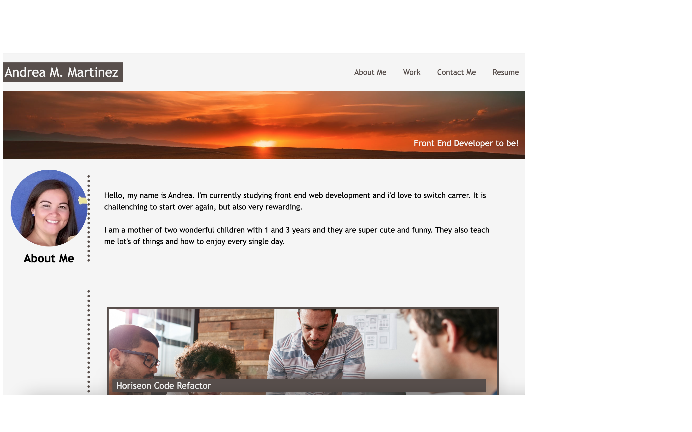
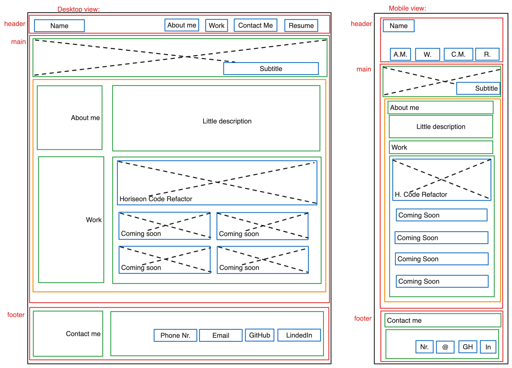

# Andrea-Melisa-Martinez-portfolio
My portfolio

## Description

This project is the second challenge from the bootcamp. In this case I needed to build my portfolio of work applying the core skills learned during the week such as: flex box, grid, media queries and CSS variables.  
The web needed to have name, a recent photo or avatar, and links to sections about me, work, and how to contact me.
In the work section, the first application image should be larger in size than the others and when clicking the image the user should be taken to the deployed application.
Also the page should have a responsive layout and adapts to the viewport (computer screen or mobile).
So, that is what I haved learned and have tried to implement in the application.

## Table of Contents
- [Installation](#installation)
- [Usage](#usage)
- [Credits](#credits)
- [License](#license)

## Installation
N/A

## Usage
To use the application here you have the link to the deployed webpage: https://andrea-melisa.github.io/Andrea-Melisa-Martinez-portfolio/ 
Click on all the links that will lead you to my GitHub portfolio, my LinkedIn or my resume.

Here you have a screenshot from the web page:

Here you have a screenshot from the previous wireframe:

## Credits

Thanks to the TA Martin William and to the tutor Andres Jimenez both from EDX.
Thanks to Nicole Santa Maria for sharing her portfolio as a guide.

Sources:
https://css-tricks.com/snippets/css/a-guide-to-flexbox/
https://css-tricks.com/snippets/css/complete-guide-grid/
https://blog.hubspot.com/website/html-telephone-link

Image: 
https://css-tricks.com/snippets/css/complete-guide-grid/

## License
Please refer to the LICENSE in the repo.

## Badges
CSS 58%

HTML 42%